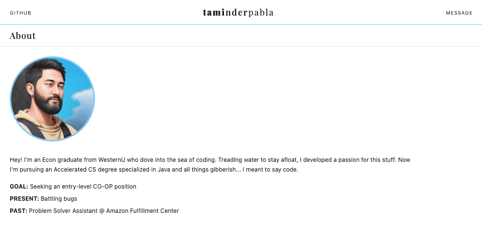
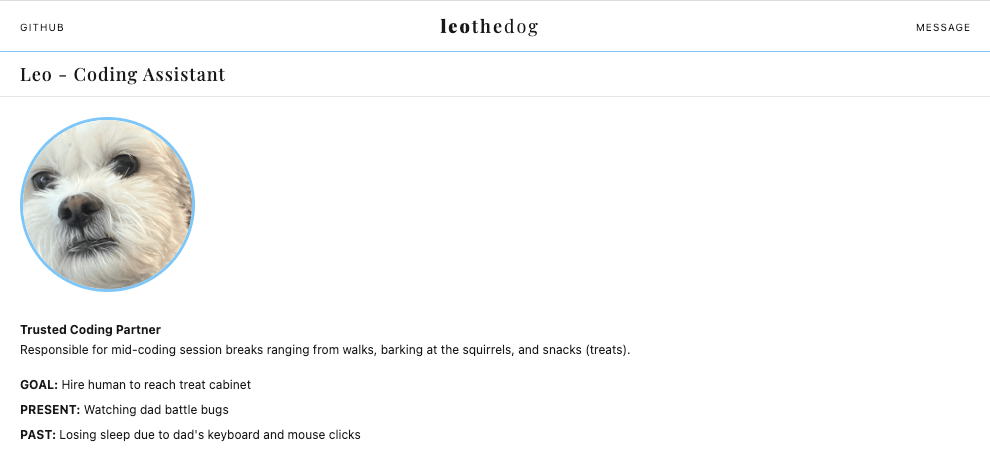

# Website - Personal Portfolio

A website created for my portfolio and personal branding. 

Also, a neat way to apply web development languages (HTML, CSS, and JavaScript) while learning about the inner workings 
of the internet (i.e. terminology, domains, hosting, DNS, seo practices, and other specifications).

Website Link: [[Click Here]](https://taminderpabla.com)

## Requirements
Requires no specification.

## Key Features
- words with gradient lettering created using various font-weights _[see header of Figure 1]_
- subpage for my pet dog, also my trusted coding buddy _[see Figure 2]_
- email forwarding for contact/message capabilities
- my portrait -- the best part -- rendered using AI of photo _[[Credit: Lensa AI]](https://apps.apple.com/us/app/lensa-ai-photo-video-editor/id1436732536)_

## How It Looks (via Chrome Desktop)

_**Figure 1:** Homepage of [taminderpabla.com](https://taminderpabla.com)_

_**Figure 2:** [Subpage](https://taminderpabla.com/code-partner-leo) with content of Leo my coding assistant_
